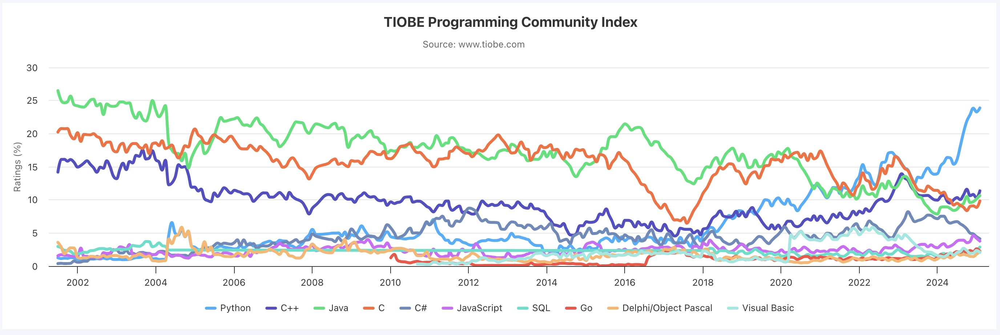

<style>
img[alt="logo"] {
  width: auto;  /* Adjust width */
  height: 25px; /* Keep aspect ratio */
  vertical-align: bottom; /* Align text with the image */
}
img[alt="pic_middle"] {
  width: auto;  /* Adjust width */
  height: 150px; /* Keep aspect ratio */
  vertical-align: middle; /* Align text with the image */
}
img[alt="pic_middle_med"] {
  width: auto;  /* Adjust width */
  height: 50px; /* Keep aspect ratio */
  vertical-align: middle; /* Align text with the image */
}
.grid {
  display: grid;
  grid-template-columns: 1fr 1fr;
  gap: 20px;
}

img[alt~="center"] {
  display: block;
  margin: 0 auto;
}
</style>

# 📢 Linguagens de Programação 1 
## 📚 Aula #1
### 💬 Message of the Day 
*“A computer would deserve to be called intelligent if it could deceive a human into believing that it was human.”* 
— Alan Turing 

---

# 🎓 Alan Turing (1912–1954)
* Desenvolveu a máquina de Turing (1936) que formalizou a ideia de **algoritmo**
- Desempenhou um papel fundamental na segunda guerra mundial por ter desencriptado o código alemão com a ajuda de uma máquina electromagnética que desenvolveu para acelerar a desencriptação. Salvou milhões de vidas e encurtou a guerra.
* Propôs o teste de Turing que é utilizado na inteligência artificial

---

# Conteúdos 
- **Introdução à Unidade Curricular** 
    - **Objetivos da Unidade Curricular** 
    - **Avaliação** 
- **Porque Aprender C?** 
- **Fundamentos da Programação** 
- **Compilação e Execução** 
- **Debug e Erros Comuns** 
- **Próximos Passos** 

---

# Módulo 0 - Unidade Curricular

---

## 🎯 Objetivos do Curso
### O que vais aprender neste curso?
* **Compreender os princípios fundamentais da computação** 
 _O que acontece nos bastidores quando programas são executados?_ 
* **Desenvolver pensamento lógico e habilidades de resolução de problemas** 
 _Programação não é sobre decorar sintaxe, mas sobre pensar estruturadamente._ 
* **Saber o que está por trás de ferramentas como garbage collectors** 
 
---

## 🎯 Objetivos do Curso (cont.)
* **Explorar estruturas de dados e gestão da memória** 
 _Por que algumas linguagens têm garbage collector? Como otimizar memória em C?_ 
* **Criar e analisar programas de forma eficiente** 
 _Debug, otimização e boas práticas para escrever código sustentável._ 
* **Conhecer a linguagem C e sua relevância em engenharia** 
 _C continua a ser usado em sistemas embebidos, OS, e aplicações de alto desempenho._ 
* **Aprender a avaliar código gerado por IA** 
 _Saber quando um código gerado por AI é eficiente, seguro e adequado ao problema._ 

---

## 📌 Objectivo Geral
_Desenvolver a capacidade de criar programas eficientes e rápidos, com boa gestão de memória estrutura lógica sólida._

---


## 🤔 Programação Além do Código

* 🛠 Programar não é apenas escrever código, mas sim **resolver problemas**.  
* 🤖 Ferramentas como **AI podem gerar código, mas não podem pensar por ti**.  
* 🚀 O que te diferencia como engenheiro é a tua capacidade de **analisar, depurar, otimizar código** além do teu **pensamento crítico**.


---

## 💡Como Aprender a Programar (Sem Depender de AI)

* 🔹 Aprender a **depurar código** é mais importante do que escrevê-lo.  
* 🔹 Faz perguntas como: **Porque é que este código funciona? Como poderia ser melhorado?**  
* 🔹 Testa, experimenta e falha — aprender programação envolve **tentativa e erro**.  

---


## 📌 Programa da Disciplina
### Módulo 0 - Unidade Curricular
- Apresentação da UC 

---

## 📌 Programa da Disciplina (cont.)
### Módulo 1 - Fundamentos da Programação em C
- Definições, Escrever, compilar e executar um programa 
- Tipos de dados
- Operadores 
- Instruções de seleção e ciclos 

### Módulo 2 - Arrays, Strings e Estruturas de Dados Simples
- Arrays e Strings
- Introdução a estruturas (`structs`) 

---

## 📌 Programa da Disciplina (cont.)
### Módulo 3 - Modularização e Boas Práticas
- Criar funções reutilizáveis 
- Passagem de parâmetros e escopo de variáveis 
- Debugging básico e boas práticas 
- Recursão e sua aplicação 

### Módulo 4 - Apontadores e Gestão da Stack
- Conceito de apontadores
- Uso de apontadores em funções
- Gestão de memória na Stack

---

## 📌 Programa da Disciplina (cont.)
### Módulo 5 - Leitura e Escrita de Ficheiros
- Introdução à manipulação de ficheiros 
- Leitura e escrita de dados 
- Organização do código para uso de ficheiros 

### Módulo 6 - Gestão de Memória e Heap
- Alocação e desalocação dinâmica 
- Uso correto de `malloc()`, `free()`, `realloc()` 
- Evitando memory leaks e segmentation faults 

---
## 📌 Programa da Disciplina (cont.)

### Módulo 7 - Estruturas de Dados Dinâmicas
- Listas Ligadas 
- Introdução a Pilhas e Filas 
- Boas práticas no uso de estruturas dinâmicas 

### Módulo 8 - Organização de Código
- Organização de código grande 
- Boas práticas para código sustentável 

---


## 👨‍🏫 Equipa Docente

* 📩 **Pedro Arroz Serra** - [pedro.serra@ulusofona.pt](mailto:pedro.serra@ulusofona.pt)  - https://www.linkedin.com/in/pedroarroz/

* 📩 **Daniel Silveira** - [daniel.silveira@ulusofona.pt](mailto:daniel.silveira@ulusofona.pt)  

* 📩 **Martijn Kuipers** - [martijn.kuipers@ulusofona.pt](mailto:martijn.kuipers@ulusofona.pt)  

* 📩 **Giosuè Muratore** - [p8344@ulusofona.pt](mailto:p8344@ulusofona.pt)  

---

# 🗂️ Conteúdos
*  **Conteúdos no Moodle da Lusófona - Curso de LEI** 

*  **Exercícios Práticos no Moodle do DEISI - https://moodle.deisi.ulusofona.pt/**

* Juntem-se ao grupo **LP1**. Password: `inlp1`

*  **Canal Slack**   

---

## 🩺🧐 Avaliação 🩻

<div class='grid'>
<div>

### **🎓 Componente Teórica (50%)**

- 📑 **Frequência Intermédia** (42.5%)
- 📑 **Frequência Final** (52.5%)
- 📑 **Quizzes** (5%)
- 🎯 **Nota mínima**: 9.5


</div>
<div>

### **🏃‍♀️ Componente Prática (50%)**

- 📝 **Exercícios** (35%)
- 📝 **Mini Projecto** (25%)
- 💡 **Projeto Final** (40% - 🎯 9.5 min.)
- 🎯 **Nota mínima**: 9.5


</div>
</div>

🔴 Se um aluno não alcançar a nota mínima numa das componentes, poderá realizar **exame de segunda época** (teórica) ou **projeto de segunda época** (prática).

---

# 🏃‍♀️ Componente Prática

## 📢 Defesa Obrigatória  
✔️ **Nota ≥ 17**
✔️ **Projeto ≥ 4 valores acima da média teórica**  
✔️ O corpo docente pode **convocar** ou **dispensar** qualquer aluno

## ⚠️ Não Comparência  
🚨 **Pode resultar em:**  
❌ **Penalização na nota**  
❌ **Reprovação (em caso de suspeita de autoria)**  

---

# 📚 Bibliografia  

📖 **C e Algoritmos** *(1ª Edição)* – **Pereira, A.**  📌 ISBN: *978-972-618-713*  

📖 **C Programming: A Modern Approach** *(2ª Edição)* – **K. N. King**  

📖 **Linguagem C** – **Damas, L.M.D.**  

📖 **The C Programming Language** *(2ª Edição)* – **Brian W. Kernighan & Dennis Ritchie** 
📌 ISBN: *0-13-110362-8*  

---

# 📅 Datas Importantes  

* 🧐🧑‍💻 **Frequência Intermédia:** 🗓️ **29/03/2024** - 10:00
* 💻 Devem trazer um computador portatil (com a bateria carregada 🔋🔋)

---

# Módulo 1 - Fundamentos da Programação em C

---

# 📜 História do C  

🛠️ **Criado nos anos 70** por **Dennis Ritchie** nos laboratórios Bell.  
🎯 Projetado para **desenvolver sistemas operativos**, sendo o **UNIX** um dos primeiros escritos em C.  
🚀 Combina **baixo nível** (controlo do hardware) com **abstração suficiente** para facilitar a programação.  

📌 **Características principais:**  
✅ **Eficiente e portátil** 📦  
✅ **Acesso direto à memória** 🔍  
✅ **Base para muitas linguagens modernas** 🔗  

---

# 🔗 Linguagens Derivadas do C  

🛠️ **C++** → Expande C com **programação orientada a objetos**.  
☕ **Java** → Inspirado no C++, mas com **gestão automática de memória**.  
🎮 **C#** → Baseado no C++, optimizado para aplicações modernas.  
🐍 **Python, Perl** → Influenciados pelo C, com implementações em C.  
🚀 **Go, Rust** → Inspirados no C, mas com segurança aprimorada.  

📌 **C ainda é essencial para sistemas operativos, compiladores e software crítico.**  


---

# 🌍 C é uma das Linguagens Mais Usadas  

📌 **Ranking TIOBE (https://www.tiobe.com/tiobe-index/):**  
  

---


# ⚠️ Desvantagens do C  

🛠 **Erros e Dificuldades:**  
- ❌ Propenso a **bugs e erros**  
- ❌ Código pode ser **difícil de entender e modificar**  
- ❌ **Gestão manual de memória** → Risco de **memory leaks**  

🔓 **Segurança:**  
- ❌ **Sem range checking**  
- ❌ **Verificação limitada de tipos na compilação**  
- ❌ **Sem proteção contra acessos inválidos na execução**

---

```c
#include <string.h>
#include <stdio.h>

int main() {
  char v[2];
  strcpy(v, "Hello world\n");  // 🛑 Buffer overflow!
  puts(v);
  return 0;
}
```

```bash
stu@linux:~$ ./programa 
*** stack smashing detected ***: <unknown> terminated
Aborted (core dumped)
```

📌 **Nunca executar como root! Um erro pode crashar todo o sistema.**  

---

# 🐞 Bugs Famosos em C  

🕰 **Bug do Ano 2000 (Y2K)**  
- Muitos sistemas armazenavam **apenas os dois últimos dígitos** do ano.  
- Em **2000**, interpretaram **00 como 1900**, causando falhas em software financeiro e governamental.  

🚀 **Falha do Ariane 5 (1996)**  
- Conversão errada de um valor **64 bits** para **16 bits**.  
- Resultou em **overflow**, levando à **autodestruição do foguetão**.  

---

# 📌 Definições Fundamentais  

---

# 🔢 O que é uma Expressão?  

📌 **Uma combinação de operandos e operadores que calcula um valor armazenado numa variável.** 
- Uma expressão pode ser **infixa**, **pós-fixa** ou **pré-fixa** consoante posição do operador

### Exemplos de expressões em C:  
```c
x = a + b   // Soma de dois valores
x = y       // Atribuição do valor de y a x
t = u + v   // Atribuição do resultado da soma de u e v a t
x <= y      // Expressão relacional (1 se verdadeiro, 0 se falso)
++j         // Incrementa j em 1 (equivalente a j = j + 1)
```
📌 Em C, **true** é representado por `1` e **false** por `0`.  

---

```c
x = y = z = 10;
```

---


✅ **📍 Expressão Infixa** - **O operador aparece entre os operandos.**  
```c
a = x + y
```
✅ **📍 Expressão Pós-fixa (Postfix) → Incremento/Decremento**  
```c
 int y = x++ // y recebe o valor de x, x incrementa.
```

✅ **📍 Expressão Pré-fixa (Prefix) → Incremento/Decremento**  
```c
 int y = ++x // x incrementa, y recebe o valor de x.
```
---

# 📌 O que é uma Instrução?  

📌 **Instruções causam ações no programa.**  
📌 Tipos de instruções em C:  
✅ **Instrução de Expressão** → Avalia uma expressão.  
✅ **Instrução Composta** → Conjunto de instruções dentro de `{ }`.  
✅ **Instrução de Controle** → Estruturas condicionais e de repetição.  

---

# 🖥️ Instruções de Expressão  

📌 **Uma instrução de expressão é uma expressão seguida de `;`.**  
📌 A sua execução avalia a expressão correspondente.  

### Exemplos:  
```c
a = 6;       // Atribui 6 a 'a'
c = a + b;   // Calcula a soma e armazena em 'c'
++j;         // Incrementa 'j' em 1
```
📌 **Não há limite de tamanho para uma instrução de expressão.**  

---

# 🔹 Instrução Composta  

📌 **Agrupa várias instruções entre `{ }`, formando um bloco único.**  
📌 Pode conter qualquer tipo de instrução.  

### Exemplo:  
```c
{
  pi = 3.141593;
  circumference = 2.0 * pi * radius;
  area = pi * radius * radius;
}
```
📌 Atua como uma **unidade única no código**.  

---

# 💬 Comentários em C

## 🔹 O que são comentários?
- São trechos de texto ignorados pelo compilador.
- Servem para documentar o código e melhorar a legibilidade.

---

## ✏️ Tipos de comentários

### 1️⃣ Comentários de linha única
```c
// Este é um comentário de linha única
printf("Olá, mundo!\n");
```

### 2️⃣ Comentários de múltiplas linhas
```c
/*
   Este é um comentário de múltiplas linhas
   Pode ocupar várias linhas no código
*/
printf("Comentários são úteis!\n");
```

---

## 🚀 Boas práticas
✅ Utilize comentários para explicar **o porquê** do código, não apenas **o que** ele faz.  
✅ Evite excesso de comentários óbvios.  
✅ Mantenha comentários atualizados com o código.  
✅ Use um padrão para facilitar a leitura.

---

## ⚠️ Erros comuns em comentários
❌ Comentar código desnecessário.
```c
// Somar dois números
int resultado = a + b;
```
❌ Comentários desatualizados podem confundir.
```c
// Multiplica os valores (mas o código soma!)
int resultado = a + b;
```

---


## ❓  Quizz - Expressões, Instruções e Comentários

<br>
<br>


---


## ⚠ Tipos de Erros em C  

### 📝 1. Erros Léxicos  
❌ **Erro no vocabulário** – palavras mal escritas ou caracteres inválidos.  

```c
int num#ero = 10;  // ❌ Erro léxico (caractere inválido #)
charp ch = 'x';  // ❌ Erro léxico (palavra mal escrita)
```

✔ Ocorrem na **fase de análise léxica** do compilador.  

---

### 📝 2. Erros Sintáticos  
❌ **Erro gramatical** – instruções mal escritas que violam as regras da linguagem.
<div class='grid'>
<div>


```c
if x == 10 {   // ❌ Erro sintático (faltam parênteses)
    printf("Erro!");
}
```
```c
for (x = 5; x < 10; else x++)
    printf("%d\n", x);

// ❌ o for não está bem construído: for (x = 5; x < 10; x++)
```

</div>
<div>

```c
if (x < 5) 
    printf("%d\n", x);
else
    printf("%d\n", -x);
else                    // ❌ não pode haver mais do que um else
    printf("%d\n", x+2);

```
</div>
</div>

✔ São detectados pelo **compilador** e impedem a compilação.  

---

### 📝 3. Erros Semânticos  
❌ **Erro de interpretação** – código correto na sintaxe e na gramática, mas com comportamento inesperado.  
<div class='grid'>
<div>

```c
int x = 5;
if (x = 0) {   // ❌ Erro semântico (atribuição em vez de comparação)
    printf("Sempre falso!");
}
```
</div>
<div>

```c
int idade = 30;
if (18 < idade < 25) {  
    printf("Idade dentro do intervalo!\n");
} else {
    printf("Idade fora do intervalo!\n");
}
```
</div>
</div>

        O programador queria verificar se idade está entre 18 e 25, mas a expressão não funciona corretamente em C.
        `18 < idade < 25` é avaliada da esquerda para a direita:
        `18 < idade` → Retorna 1 (verdadeiro).
        `1 < 25` → Sempre retorna 1, então a condição é sempre verdadeira!
✔ **Não são detectados pelo compilador**, mas podem causar erros lógicos.  

---

## ✅ Resumo de tipos de erro

| Tipo de Erro  | Causa  | Detectado pelo Compilador?  |
|--------------|--------|---------------------------|
| **Léxico**   | Palavras mal escritas  | ✔ Sim  |
| **Sintático** | Instruções mal escritas | ✔ Sim  |
| **Semântico** | Código incorreto logicamente | ❌ Não  |

🚀 **Erros léxicos e sintáticos impedem a compilação.**  
⚠ **Erros semânticos podem ser difíceis de encontrar!**  

---

## ❓  Quizz - Tipos de Erro

<br>
<br>


---


## Estrutura Básica de um Programa em C

```c                         
#include <stdio.h>

int main() {
    printf("Olá, Mundo!\n");
    return 0;
}
```

- 🛠 **Preprocessador**: `#include <stdio.h>`  
- 📌 **Função principal**: `int main()`  
- 📦 **Saída para o utilizador**: `printf()`  
- 🚀 **Fim do programa**: `return 0;`  

---

## Compilação e Execução

1. **Escrever o código** (`programa.c`)  
2. **Compilar** com GCC:  
    ```sh
    gcc programa.c -o programa
    ```  
3. **Executar**:  
    ```sh
    ./programa
    ```  

---


## Próxima Aula

📌 **Tópicos da próxima aula:**  
- Tipos de Dados e Variáveis.  
- Representação de Memória.  
- Conversões de Tipos.  

---

## Q&A

💬 **Dúvidas?**  