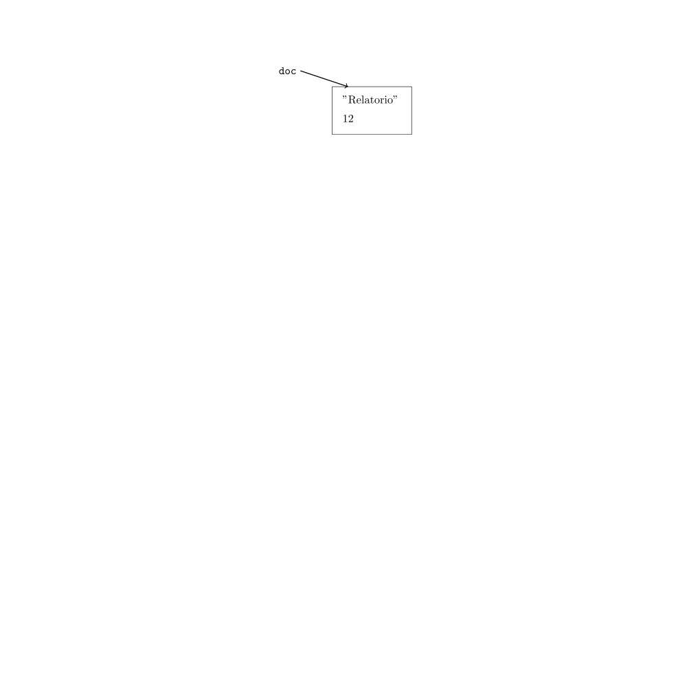

<style>
img[alt="logo"] {
  width: auto;  /* Adjust width */
  height: 25px; /* Keep aspect ratio */
  vertical-align: bottom; /* Align text with the image */
}
img[alt="pic_middle"] {
  width: auto;  /* Adjust width */
  height: 150px; /* Keep aspect ratio */
  vertical-align: middle; /* Align text with the image */
}
.grid {
  display: grid;
  grid-template-columns: 1fr 1fr;
  gap: 15px;
}
img[alt~="center"] {
  display: block;
  margin: 0 auto;
}

ul { list-style-type: none; padding-left: 10;}

</style>

# 📢 Linguagens de Programação 1  

<div data-marpit-fragment>

```c
puts("Aula #10");
```

</div>

---

# 🥊 Conteúdo

- **Listas ligadas**

---

# Problema real: Impressora em ação 🖨️

Queremos construir um programa que gere uma fila de impressão:
- A impressora recebe vários documentos 📄
- Cada documento tem um **título** e número de **páginas** 📑
- A ordem de impressão deve ser **FIFO** (First In First Out) 🕒
- O título tem no máximo 99 caracteres

---

# Representar um Documento 📄

Começamos por criar uma estrutura para armazenar cada documento:

```c
#define DIM 100

typedef struct _documento {
  char titulo[DIM];
  int paginas;
} Documento;
```

- Como guardamos todos os documentos na fila de impressão? 🤔

---

# Hipótese A: Vector fixo 📏

<div class='grid'>
<div>

```c
#define MAX_DOCS 1000
Documento fila[MAX_DOCS];
int ultimo = 0; // índice da próxima posição livre
```

</div>
<div>

✅ Simples e rápido no acesso por índice  
❌ E se chegarmos ao fim do vetor?  
❌ E se só usarmos metade? Memória desperdiçada 💸
❌ Exige deslocações ao remover o primeiro elemento

</div>
</div>


---

# Hipótese B: Vetor dinâmico 💡

<div class='grid'>
<div>

```c
int capacidade = 100;
Documento *fila = malloc(capacidade * sizeof(Documento));
assert(fila != NULL && "Out of Memory");
int ultimo = 0;
```

</div>
<div>

✅ Podemos aumentar dinamicamente com `realloc()`  
❌ Reorganizar elementos obriga a operações lentas  
❌ Exige deslocações ao remover o primeiro elemento (lento)

</div>
</div>

---

# Hipótese C: Cada doc. aponta para o próximo 🔗

<div class='grid'>
<div>

E se cada documento soubesse **quem vem a seguir**?

```c
typedef struct _documento {
  char titulo[100];
  int paginas;
  struct _documento *proximo;
} Documento;
```

</div>
<div>

📍 Agora podemos:
- Inserir um novo documento sem mover os anteriores
- Remover o primeiro documento facilmente
- Usar só a memória que precisamos ✅


</div>
</div>


---

# Visualização da fila de impressão 🧠


✅ Cresce dinamicamente sem limite fixo  
✅ Inserções e remoções são eficientes  
✅ Memória alocada só quando necessário

❌ Percorrer a lista até ao fim é necessário para inserir  
❌ Acesso aleatório lento (não é como vetor)


* Cada documento aponta para o próximo, até ao fim da fila!


---

## Criar um documento

<div class='grid'>
<div>

```c
Documento * criaDoc(char * titulo, int paginas)
{
  Documento * doc = (Documento *) malloc(sizeof(Documento));
  if (doc == NULL) {
    puts("Out of Memory");
    exit(0);
  }
  strcpy(doc->titulo, titulo);
  doc->paginas = paginas;
  doc->proximo = NULL;
  return doc;
}
```

</div>
<div>

- Sempre que necessário aloca-se memória na zona de memória dinâmica para um novo documento:

```c
int main()
{
  Documento * doc = criaDoc("Relatorio", 12);

  ...
}
```


{.large alt=""}


</div>
</div>


---

# Criar uma lista ligada

---

# Criar e inicializar a lista 🧱

<div class='grid'>
<div>

1. Definição da estrutura: 
```c
typedef struct _documento {
  char titulo[100];
  int paginas;
  struct _documento *proximo;
} Documento;
```

</div>
<div>

2. Inicialização da fila

```c
int main()
{
  Documento *fila = NULL; // lista inicialmente vazia


  return 0;
}
```

</div>
</div>


🟢 A fila começa com `NULL`, indicando que está vazia.

---

## Inserir documento no fim da fila 🆕

<small>

```c
void inserir(Documento **fila, Documento * doc) {
  Documento *aux;
  assert(fila != NULL && "List not valid");

  // se a fila estiver vazia, doc será o unico nó
  // logo *fila fica a apontar para o doc
  if (*fila == NULL) {
    *fila = doc;
    return;
  }

  // caso nao esteja vazia temos de percorrer a lista até encontrar o ultimo nó
  for (aux = *fila ; aux->proximo != NULL; aux = aux->proximo);

  // depois de encontrado o ultimo nó, só temos de colocar o novo (doc) como sendo o ultimo
  aux->proximo = doc;
}
```

</small>

---

# Remover o primeiro documento 🧹

```c
void remover(Documento **fila) {
  Documento *aux;
  assert(fila != NULL && "List not valid");

  // se a lista estiver vazia, não faz nada
  if (*fila == NULL)
    return;

  aux = *fila;
  *fila = aux->proximo;

  free(aux);
}
```

📦 Remove o documento mais antigo — comportamento FIFO

---

# Listar documentos na fila 📜

- Para percorrer a lista, a função apenas necessita do apontador para o inicio da lista.
- Não precisa do endereço do apontador para o início da lista pois não vai alterar o seu valor, apenas ler

```c
void listar(Documento *fila) {

  while (fila != NULL) {
    printf("%s (%d páginas)\n", fila->titulo, fila->paginas);
    fila = fila->proximo;
  }

}
```

🖨️ Mostra o estado atual da fila

---

# Função principal com menu 🧭

<div class='grid'>
<div>


```c
#define OPT_REM 'R'
#define OPT_ADD 'N'
#define OPT_LIST 'L'
#define OPT_QUIT 'Q'
#define DIM 1000

int main() {
  Documento *fila = NULL;
  Documento aux;
  char option, input[DIM];

  while (1) {
    putchar('>');
    fgets(input, DIM, stdin);
    
    // se não conseguir ler um caracter, volta a esperar input
    if (sscanf(input, " %c ", &option) != 1)
      continue;

```

</div>
<div>

```c
    switch(toupper(option))
    {
    case OPT_REM:
      remover(&lista);
      continue;
    case OPT_ADD:
      if (sscanf(input, " %c %d %[^\n]s", &option, &aux.paginas, aux.titulo) != 3)
        continue;
      inserir(&fila, aux.titulo, aux.paginas);
    case OPT_LIST:
      listar(fila);
    continue;
    case OPT_QUIT:
      exit(0);
  }
}
```

</div>
</div>

---

# Recapitulando 📌

| Operação | Função usada     | Complexidade |
|----------|------------------|--------------|
| Inserir  | `inserir()`      | O(n)         |
| Remover  | `remover()`      | O(1)         |
| Listar   | `listar()`       | O(n)         |

💡 Para inserção rápida no início, basta alterar a lógica!

---

# Próximos passos? 🚀

- Inserção ordenada (por nome, páginas, etc.)
- Libertar toda a lista no fim do programa
- Uso de `typedef` para simplificar ponteiros
- Implementar uma fila genérica com `void *`?


---

# Tipos Enumerados (`enum`) em C 🧠

---

# O que é um `enum`? 🏷️

- Um `enum` permite **definir nomes simbólicos** para valores inteiros.
- Facilita a **leitura**, **organização** e **validação** de valores dentro de um conjunto limitado.

✨ Ideal quando uma variável só pode assumir **um conjunto restrito de valores**.

---

# Declaração de um `enum` 📜

```c
enum week_day { mon, tue, wed, thu, fri, sat, sun };
```

💡 Por padrão:
- `mon = 0`, `tue = 1`, ...`sun = 6`

Mas podemos atribuir valores manualmente:

```c
enum week_day { mon = 1, tue, wed, thu = 10, fri, sat, sun };
```

➡️ `tue = 2`, `wed = 3`, `fri = 11`, etc.

---

# Usar um `enum` ✍️

```c
// definicao do enum (fora das funcoes)
enum week_day { mon, tue, wed, thu, fri, sat, sun };

// declaracao de variaveis com esse tipo
enum week_day today;
enum week_day tomorrow = tue;

today = mon;
```

- As variáveis `today` e `tomorrow` só podem assumir valores do tipo `week_day`.

🔐 Protege contra valores inválidos e torna o código mais legível!

---

# Visualização 🧠

<div class='grid'>
<div>

```c
enum traffic_light { red, yellow, green };

enum traffic_light t;
t = green;
```

</div>
<div>

| Nome     | Valor |
|----------|-------|
| `red`    | 0     |
| `yellow` | 1     |
| `green`  | 2     |

🎯 `t` assume apenas valores válidos para `traffic_light`.

</div>
</div>

---

# Comparar com constantes `#define` ❓

<div class='grid'>
<div>

❌ Usar `#define`

```c
#define MON 0
#define TUE 1
...
int d = MON;
```

</div>
<div>

✅ Melhor com `enum`

```c
enum week_day { mon, tue, wed };
enum week_day d = mon;
```

✔️ Mais seguro  
✔️ Mais legível  
✔️ Debug mais fácil

</div>
</div>

---

# Bonus: `typedef` + `enum` 🎁

```c
typedef enum { spring, summer, autumn, winter } Season;

Season s = summer;
```

🎯 Evita repetir `enum` na declaração de variáveis.

---

# Dicas finais 💡

- Os valores são inteiros (`int`)
- Podem ser comparados com `==`, `switch`, etc.
- Ideal para estados, dias da semana, cores, comandos...


---

# ❓ Q&A  

💬 **Dúvidas?**  
