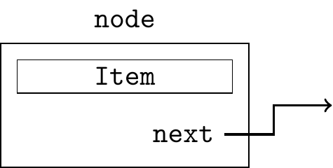
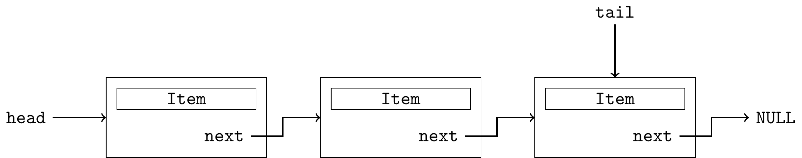

<style>
img[alt="logo"] {
  width: auto;  /* Adjust width */
  height: 25px; /* Keep aspect ratio */
  vertical-align: bottom; /* Align text with the image */
}
img[alt="pic_middle"] {
  width: auto;  /* Adjust width */
  height: 150px; /* Keep aspect ratio */
  vertical-align: middle; /* Align text with the image */
}
.grid {
  display: grid;
  grid-template-columns: 1fr 1fr;
  gap: 20px;
}


img[alt~="center"] {
  display: block;
  margin: 0 auto;
}
ul { list-style-type: none; padding-left: 0;}

img.node-img {
  width: 100%;
  max-width: none;
  height: auto;
}


</style>

# 📢 Linguagens de Programação 1  


```c
puts("Aula #%11");
```

---

# Conteúdo

* **Listas Genéricas**
* *Listas simples com head e tail*
* **Macros**


---

## Listas genéricas

Objectivo: Separar o conteúdo que queremos gravar da estrutura da lista.

Ideia: definir um nó da lista como um estrutura que inclui um Item e um apontador para o próximo

<div class='grid'>
  <div style="order: 1;">



</div>
  <div style="order: 2;">

~~~c
typedef struct _node {
  Item item;
  struct _node * next;
} node;
~~~

```c
typedef struct {
  char nome[100];
  enum {M,F,I} gender;
} pessoa;

typedef pessoa Item;
```


</div>
</div>

---
## Listas genéricas

<div class='grid'>
  <div>

* Código para implementar a lista a colocar no ficheiro `list.h`

~~~c
#include "Item.h"

typedef struct _node {
  Item item;
  struct _node * next;
} node;
~~~

</div>
<div>

* Código que trata o "payload" a colocar no ficheiro `Item.h`
```c
typedef struct {
  char nome[100];
  enum {M,F,I} gender;
} pessoa;

typedef pessoa Item;
```


</div>
</div>

---

## Lista simplesmente ligada com *head e tail pointer*




<div class='grid'>
  <div>

~~~c
#include "Item.h"

typedef struct _node {
  Item item;
  struct _node * next;
} node;

typedef struct {
  node * head;
  node * tail;
} List;
~~~


</div>
<div>

- Código no ficheiro `list.h`


- Podemos definir uma estrutura nova (`List`) que serve para guardar o apontador para o `head` e o apontador para o `tail`

</div>
</div>


---

# Inicializar

<div class='grid'>
  <div>

* ficheiro `list.c`:

~~~c
List * ListNew(void) {
  List * L  = (List *) malloc(sizeof(*L));
  L -> head = L -> tail = NULL;
  return L;
}
~~~


</div>
<div>

* ficheiro `main.c`

~~~c
int main() {
  List *L = ListNew();
  ...
}
~~~

</div>
</div>


---

## Inserir no fim da lista


<div class='grid'>
  <div>

<small>

```c
node * NodeNew(Item i) {
  node * new = (node *) malloc (sizeof(node));
  if (new == NULL) exit(1); // out of memory
  new -> item = i;
  new -> next = NULL;
  return new;
}

void ListInsertEnd(List * L, Item i) {  
  node * new = NodeNew(i);
  if (ListEmpty(L))
    L -> tail = L -> head = new;
  else {
    L -> tail -> next = new;
    L -> tail = new;
  }
}

int ListEmpty(L) {
  return L->head == NULL;
}
```

</small>

</div>
<div>

* ficheiro `main.c`
~~~c
int main() {
  List *L = ListNew();
  Item p = {"Marcella", F};

  ListInsertEnd(L, p);

  ...
}

~~~

</div>
</div>

---

## Inserir no início da lista

<div class='grid'>
  <div>


```c
void ListInsertTop(List * L, Item i)
{
  node * new = NodeNew(i);

  if (ListEmpty(L)) {
    L -> tail = L -> head = new;
    return;
  }

  
  new -> next = L -> head;
  L -> head = new;
}
```

</div>
<div>

* ficheiro `main.c`
~~~c
int main() {
  List *L = ListNew();
  Item p = {"Marcella", F};

  ListInsertTop(L, p);

  ...
}

~~~

</div>
</div>

---


# Remover o primeiro elemento

<div class='grid'>
  <div>

```c
// esta funcao nao pode ser chamada se
// a lista estiver vazia
Item ListRemoveTop(List * L)
{
  Item i;
  node * t;

  if (ListEmpty(L)) {
    puts("Error: Empty List");
    exit(0);
  }

  i = L -> head -> item;
  // auxiliar que guarda o head que vamos eliminar
  t = L -> head;
  L -> head = L -> head -> next;
  free(t);

  // se a lista ficou vazia,
  // temos que actualizar o tail
  if (ListEmpty(L))
    L -> tail = NULL;

  return i;
}
```

</div>
<div>

* ficheiro `main.c`
~~~c
int main() {
  List *L = ListNew();
  Item p = {"Marcella", F};
  Item i;

  ListInsertTop(L, p);

  if (!ListEmpty(L))
    i = ListRemoveTop(L);
  ...
}
~~~

</div>
</div>

---

## Remover o último elemento

<div class='grid'>
  <div>

```c
// esta funcao nao pode ser chamada se
// a lista estiver vazia
Item ListRemoveEnd(List * L)
{
  Item i;
  node * t, * aux;

  if (ListEmpty(L))
    exit(1);

  i = L -> tail -> item;
  t = L -> tail;

  // se a lista só tinha um elemento,
  // ficará vazia e temos que actualizar o head
  if (t == L -> head)
    L -> head = L -> tail = NULL;
  else
  {
    // temos que encontrar o no anterior ao tail
    // para o actualizarmos
    for (aux = L -> head ; aux -> next == t; aux = aux -> next)
      ;

    aux -> next = NULL;
    L -> tail = aux;
  }

  free(t);
  return i;
}
```

</div>
<div>

* ficheiro `main.c`
~~~c
int main() {
  List *L = ListNew();
  Item p = {"Marcella", F};
  Item i;

  ListInsertTop(L, p);

  if (!ListEmpty(L))
    i = ListRemoveEnd(L);
  ...
}
~~~

</div>
</div>

---

## Imprimir todos os elementos

~~~c
void ItemPrint(Item i) {
  char enum2char[] = {'M', 'F', 'I'};
  printf("%s - (%c)\n", i.nome, enum2char[i.gender])
}

int main() {
  List *L = ListNew();
  Item a = {"Marcella", F}, b = {"Mariah", F}, c = {"Manu", F};
  node * t;

  ListInsertTop(L, a);
  ListInsertTop(L, b);
  ListInsertEnd(L, c);

  for(t = L->head; t != NULL ; t = t -> next)
    ItemPrint(t -> item);
}
~~~

---

# Recapitulando 📌

| Operação | Função usada     | Complexidade |
|----------|------------------|--------------|
| Inserir  | `ListInsertTop()`      | O(1)         |
| Inserir  | `ListInsertEnd()`      | O(1)         |
| Remover  | `ListRemoveTop()`      | O(1)         |
| Remover  | `ListRemoveEnd()`      | **O(n)**        |
| Listar   | `ListPrint()`       | O(n)         |


---

* 💡 continuamos a ter O(n) nas inserções no fim porque temos que encontrar o nó antes do `tail`. Como podemos melhorar?

* Usamos uma lista duplamente ligada em que cada nó aponta para o próximo e também para o anterior.

* Vamos ver na próxima aula.


---


# Macros


---

## Macros - problema

<div class='grid'>
  <div>


* Implemente uma função que devolve a multiplicação de dois valores numéricos:

<div data-marpit-fragment>

~~~c
int Mult(int a, int b)
{
  return a * b;
}
~~~

</div>

</div>
<div>


* E se os operandos forem floats, podemos alterar a função?

<div data-marpit-fragment>

~~~c
float Mult(float a, float b)
{
  return a * b;
}
~~~

</div>


</div>
</div>

* 🤷‍♂️ Parece que estamos a repetir código! O conteúdo das duas funções é exactamente o mesmo! 🤦‍♂️

* E se quisermos usar as duas funções no mesmo programa, teremos de lhes dar nomes diferentes

---

# Solução: Macro 🎯


* São porções de código que são substituídas pelo pré-processador, antes do compilador passar pelo código.

<div data-marpit-fragment>

~~~c
#define DIM 100
~~~

</div>

* Começa por `#` logo não é uma instrução
* Também não termina com `;`
* Trata-se de uma directiva ao pré-processador para que substitua todas as ocorrências de DIM pelo valor 100.
* O pré-processador substitui antes da compilação 🛠️


---

# Exemplo com macro `Mult` 🧮

<div class='grid'>
  <div>

* Código original

<div data-marpit-fragment>

~~~c
#include <stdio.h>
#define Mult(x, y) x * y

int main() {
    int a = 4;
    float b = 1.5;
    float z = Mult(a, b);
    printf("%f\n", z); // 6.000000
    return 0;
}
~~~

</div>

</div>
<div>

* Expansão de código pelo pré-compilador

<div data-marpit-fragment>

~~~c
#include <stdio.h>
#define Mult(x, y) x * y

int main() {
    int a = 4;
    float b = 1.5;
    float z = a * b;
    printf("%f\n", z); // 6.0000
    return 0;
}
~~~

</div>
</div>
</div>

* 🧠 O pré-processador substitui `Mult(a, b)` por `a * b`

---

## ❓  Quizz - Macros

<br>


<br>


- No campo nome devem colocar o **número de aluno** 2XXXXXXX.


---

## Exercício - Qual o resultado?

<div class='grid'>
  <div>

* Qual o valor da variável `z`?

<div data-marpit-fragment>

~~~c
#define Mult(x, y) x * y

int main() {
  float z = Mult(3+1,2+3);
  return 0;
}
~~~

</div>

</div>
<div>

* Expansão de código pelo pré-compilador

<div data-marpit-fragment>

~~~c
#define Mult(x, y) x * y

int main() {
  float z = 3+1 * 2+3; // = 8  
  return 0;
}
~~~

</div>
</div>
</div>

* ⚠️ O pré-processador substitui `Mult(3+1, 2+3)` por `3+1 * 2+3`. 

* 💡 Temos que modificar a macro para incluir parêntesis à volta dos parâmetros!

<div data-marpit-fragment>

```c
#define Mult(x,y) (x)*(y)
```

</div>

---

## ❓  Quizz - Macros

<br>


<br>


- No campo nome devem colocar o **número de aluno** 2XXXXXXX.


---

## Exercício - Qual o resultado?

<div class='grid'>
  <div>

* Qual o valor da variável `z`?

<div data-marpit-fragment>

~~~c
#define Mult(x,y) (x)*(y)

int main() {
  float z = 10/Mult(2,5);
  return 0;
}
~~~

</div>

</div>
<div>

* Expansão de código pelo pré-compilador

<div data-marpit-fragment>

~~~c
#define Mult(x,y) (x)*(y)

int main() {
  float z = 10/(2)*(5); // = 25
  return 0;
}
~~~

</div>
</div>
</div>

* ⚠️ Continuamos a obter um resultado inesperado. 

* 💡 Temos que modificar a macro para incluir parêntesis à volta de toda a macro!

<div data-marpit-fragment>

```c
#define Mult(x,y) ((x)*(y))
```

</div>

---

# Solução correta ✅

Coloca **parêntesis em tudo**:

~~~c
#define Mult(x, y) ((x) * (y))
~~~

Evita ambiguidades em qualquer expressão 🧠

---

# Regra de ouro 🥇

**Usa sempre 2 níveis de parêntesis:**

~~~c
#define Min(a, b) a < b ? a : b
~~~


* 1. À volta dos parâmetros `#define Min(a, b) (a) < (b) ? (a) : (b)`
* 2. À volta das expressões internas `#define Min(a, b) ((a) < (b)) ? (a) : (b)`
* 3. À volta da macro inteira `#define Min(a, b) (((a) < (b)) ? (a) : (b))`

~~~c
#define Min(a, b) (((a) < (b)) ? (a) : (b))
~~~

---

# Macros podem ser multiline? 🧵

Sim! Usa `\` para continuar na linha seguinte:

~~~c
#define Min(a, b) (((a) < (b)) ? \
                   (a) : \
                   (b))
~~~

Mais legível e sem erros de compilação

---

# Macros com o operador `#` 🗣️

Transforma o argumento em string:

~~~c
#define Show(x) printf(#x)

int main() {
    Show(Use the force); // => printf("Use the force");
}
~~~

🧠 Útil para debug!

---

# Macros com `##` (token paste) 🔗

Une identificadores:

~~~c
#define VAR(v) n##v

int n1, n2;
VAR(1) = 100; // equivale a: n1 = 100;
~~~

Usado para gerar nomes dinamicamente

---

# Erros frequentes 😱

- **Esquecer o `;` fora da macro**:

~~~c
#define MAX 100 // CORRETO
#define MAX 100; // ERRO ❌
~~~

- **Usar `=` em vez de valor**:

~~~c
#define MAX = 100 // ERRO ❌
~~~

- **Espaço entre nome e parêntesis**:

~~~c
#define Min (a,b) (((a)<(b))?(a):(b)) // ERRO: substitui "Min" por tudo!
~~~

---

# Exercício 1 🧠

Cria uma macro `Cube(x)` que devolve o cubo de um número (`x * x * x`)  
Testa com:

~~~c
int a = 2;
int b = Cube(a + 1); // Qual o valor de b?
~~~

**Dica**: Usa os 3 níveis de parêntesis!

---

# Exercício 2 🧠

Cria uma macro chamada `IsEven(x)` que retorna 1 se `x` for par, 0 caso contrário.  
**Usa operador ternário**.

Testa-a com:

~~~c
int x = 4;
if (IsEven(x)) {
    printf("É par!\n");
}
~~~

---

# Exercício 3: Debug 🐞

Corrige esta macro e explica o erro:

~~~c
#define AVG(a,b) a + b / 2

int x = AVG(4, 6);
~~~

🧠 Qual o resultado real? E o esperado?

---

# Conclusão ✨

| Vantagem         | Risco               |
|------------------|---------------------|
| Reutilização     | Resultados errados  |
| Flexível         | Precedência perigosa|
| Substituição rápida | Difícil de debugar|

🚀 Macros são poderosas, mas devem ser usadas com **cuidados claros**

---

# ❓ Q&A  

💬 **Dúvidas?**  
