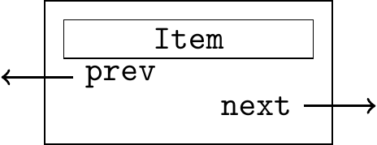
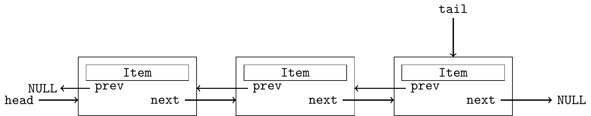

<style>
img[alt="logo"] {
  width: auto;  /* Adjust width */
  height: 25px; /* Keep aspect ratio */
  vertical-align: bottom; /* Align text with the image */
}
img[alt="pic_middle"] {
  width: auto;  /* Adjust width */
  height: 150px; /* Keep aspect ratio */
  vertical-align: middle; /* Align text with the image */
}
.grid {
  display: grid;
  grid-template-columns: 1fr 1fr;
  gap: 20px;
}

img[alt~="center"] {
  display: block;
  margin: 0 auto;
}
ul { list-style-type: none; padding-left: 0;}

</style>

# 📢 Linguagens de Programação 1  

<div data-marpit-fragment>

```c
puts("\aAula #12");
```

</div>

---

# Conteúdo

- Listas duplamente ligadas
- O pré-compilador
- Organizar o código em múltiplos ficheiros

---

## Lista Duplamente Ligada

* Cada nó tem um apontador para o próximo e um apontador para o anterior

<div class='grid'>
  <div style="order: 1;">



</div>
  <div style="order: 2;">

~~~c
typedef struct _node {
  Item item;
  struct _node * next, * prev;
} node;
~~~

```c
typedef struct {
  char nome[100];
  enum {M,F,I} gender;
} pessoa;

typedef pessoa Item;
```


</div>
</div>

---
## Lista Duplamente Ligada

<div class='grid'>
  <div>

* Código para implementar a lista a colocar no ficheiro `list.h`

~~~c
#include "Item.h"

typedef struct _node {
  Item item;
  struct _node * next, * prev;
} node;
~~~

</div>
<div>

* Código que trata o "payload" a colocar no ficheiro `Item.h`
```c
typedef struct {
  char nome[100];
  enum {M,F,I} gender;
} pessoa;

typedef pessoa Item;
```


</div>
</div>

---

## Lista simplesmente ligada com *head e tail pointer*




<div class='grid'>
  <div>

~~~c
#include "Item.h"

typedef struct _node {
  Item item;
  struct _node * next, * prev;
} node;

typedef struct {
  node * head;
  node * tail;
} List;
~~~


</div>
<div>

- Código no ficheiro `list.h`


- Podemos definir uma estrutura nova (`List`) que serve para guardar o apontador para o `head` e o apontador para o `tail`

</div>
</div>


---

# Inicializar

<div class='grid'>
  <div>

* ficheiro `list.c`:

~~~c
List * ListNew(void) {
  List * L  = (List *) malloc(sizeof(*L));
  L -> head = L -> tail = NULL;
  return L;
}
~~~


</div>
<div>

* ficheiro `main.c`

~~~c
int main() {
  List *L = ListNew();
  ...
}
~~~

</div>
</div>


---

## Inserir no fim da lista


<div class='grid'>
  <div>

<small>

```c
node * NodeNew(Item i) {
  node * new = (node *) malloc (sizeof(node));
  if (new == NULL) exit(1); // out of memory
  new -> item = i;
  new -> next = n -> prev = NULL;
  return new;
}

void ListInsertEnd(List * L, Item i) {  
  node * new = NodeNew(i);
  if (ListEmpty(L))
    L -> tail = L -> head = new;
  else {
    L -> tail -> next = new;
    new -> prev = L -> tail;
    L -> tail = new;
  }
}

int ListEmpty(List *L) {
  return L->head == NULL;
}
```

</small>

</div>
<div>

* ficheiro `main.c`
~~~c
int main() {
  List *L = ListNew();
  Item p = {"Marcella", F};

  ListInsertEnd(L, p);

  ...
}

~~~

</div>
</div>

---

## Inserir no início da lista

<div class='grid'>
  <div>


```c
void ListInsertTop(List * L, Item i)
{
  node * new = NodeNew(i);

  if (ListEmpty(L)) {
    L -> tail = L -> head = new;
    return;
  }
  
  new -> next = L -> head;
  L -> head -> prev = new;
  L -> head = new;
}
```

</div>
<div>

* ficheiro `main.c`
~~~c
int main() {
  List *L = ListNew();
  Item p = {"Marcella", F};

  ListInsertTop(L, p);

  ...
}

~~~

</div>
</div>

---


# Remover o primeiro elemento

<div class='grid'>
  <div>

```c
// esta funcao nao pode ser chamada se
// a lista estiver vazia
Item ListRemoveTop(List * L)
{
  Item i;
  node * t;

  if (ListEmpty(L)) exit(0);

  i = L -> head -> item;
  // auxiliar que guarda o head que vamos eliminar
  t = L -> head;
  L -> head = L -> head -> next;
  free(t);
  
  // se a lista ficou vazia,
  // temos que actualizar o tail
  if (ListEmpty(L))
    L -> tail = NULL;
  else
    // caso contrário temos que actualizar o prev
    L -> head -> prev = NULL;

  return i;
}
```

</div>
<div>

* ficheiro `main.c`
~~~c
int main() {
  List *L = ListNew();
  Item p = {"Marcella", F};
  Item i;

  ListInsertTop(L, p);

  if (!ListEmpty(L))
    i = ListRemoveTop(L);
  ...
}
~~~

</div>
</div>

---

## Remover o último elemento

<div class='grid'>
  <div>

```c
// esta funcao nao pode ser chamada se
// a lista estiver vazia
Item ListRemoveEnd(List * L)
{
  Item i;
  node * t, * aux;

  if (ListEmpty(L)) exit(1);

  i = L -> tail -> item;
  t = L -> tail;

  // se a lista só tinha um elemento,
  // ficará vazia e temos que actualizar o head
  if (t == L -> head)
    L -> head = L -> tail = NULL;
  else {
    // actualizar o penultimo
    t -> prev -> next = NULL;
    L -> tail = t -> prev;
  }

  free(t);
  return i;
}
```

</div>
<div>

* ficheiro `main.c`
~~~c
int main() {
  List *L = ListNew();
  Item p = {"Marcella", F};
  Item i;

  ListInsertTop(L, p);

  if (!ListEmpty(L))
    i = ListRemoveEnd(L);
  ...
}
~~~

</div>
</div>

---

## Imprimir todos os elementos

~~~c
void ItemPrint(Item i) {
  char enum2char[] = {'M', 'F', 'I'};
  printf("%s - (%c)\n", i.nome, enum2char[i.gender]);
}

int main() {
  List *L = ListNew();
  Item a = {"Marcella", F}, b = {"Mariah", F}, c = {"Manu", F};
  node * t;

  ListInsertTop(L, a);
  ListInsertTop(L, b);
  ListInsertEnd(L, c);

  for(t = L->head; t != NULL ; t = t -> next)
    ItemPrint(t -> item);
}
~~~

---

# Recapitulando 📌

| Operação | Função usada     | Complexidade |
|----------|------------------|--------------|
| Inserir  | `ListInsertTop()`      | O(1)         |
| Inserir  | `ListInsertEnd()`      | O(1)         |
| Remover  | `ListRemoveTop()`      | O(1)         |
| Remover  | `ListRemoveEnd()`      | O(1)        |
| Listar   | `ListPrint()`       | O(n)         |

---

# Recursividade

---

# Contagem decrescente sem ciclo 🧮

Como escrever uma função que conte de `n` até `0` sem usar `for` ou `while`?


<div class='grid'>
  <div>

## Versão com ciclo:

~~~c
void count_down(unsigned int n) {
    for (int i = n; i >= 0; i--)
        printf("%d\n", i);
}
~~~

</div>
<div>

## Versão recursiva 🔂

~~~c
void count_down(unsigned int n) {
    printf("%d\n", n);
    if (n > 0)
        count_down(n - 1);
}
~~~

🧠 A função chama-se a si própria com um valor mais pequeno  
➡️ Até chegar ao caso base (`n == 0`)

</div>
</div>


---

# O que é recursividade? 🤔

📌 Recursividade é a **capacidade de uma função se invocar a si própria**

🔁 Cada chamada é empilhada na **stack (pilha)**  
🧠 Útil quando o problema pode ser dividido em subproblemas mais simples

---

# Recursividade vs Iteração ⚔️

| Recursiva                   | Iterativa                     |
|----------------------------|-------------------------------|
| Código mais compacto       | Pode ser mais eficiente       |
| Mais memória (stack) usada | Menos memória usada           |
| Elegante para certos casos | Boa para grandes entradas     |
| Necessita de caso base     | Usa ciclo `for` ou `while`    |

---

# Exemplo: Fatorial de `n` 🎯

~~~c
int factorial(int n) {
    if (n > 1)
        return n * factorial(n - 1);
    return 1;
}
~~~

🧠 f(4) → 4 × f(3) → 4 × 3 × f(2) → 4 × 3 × 2 × f(1) → ...

---

# O que acontece na memória? 🧠

Cada chamada guarda:
- Variáveis locais
- Estado de execução

📦 Tudo isso é armazenado na **stack**

⛔ Demasiadas chamadas → `stack overflow`

---

# Exemplo passo-a-passo

~~~c
int fact(int n) {
    int r;
    if (n > 1)
        r = n * fact(n - 1);
    else
        r = 1;
    return r;
}
int main() {
    int n = fact(4);
    return 0;
}
~~~

---

## ❓  Quizz - Recursividade

<br>


<br>


- No campo nome devem colocar o **número de aluno** 2XXXXXXX.


---

# Quiz 1 🤓

Determine o valor final de `res`:

~~~c
int pw(int x, int n) {
    if (n == 0) return 1;
    return x * pw(x, n - 1);
}
int main() {
    int res = pw(2, 4);
    return 0;
}
~~~

✍️ **Resposta**: 2⁴ = **16**

---

## ❓  Quizz - Recursividade 2

<br>


<br>


- No campo nome devem colocar o **número de aluno** 2XXXXXXX.


---
# Quiz 2 🤓

Determine o valor de `res`:

~~~c
int rec(int n) {
    if (n > 0) return n + rec(n - 1);
    return -1;
}
int main() {
    int res = rec(4);
    return 0;
}
~~~

✍️ **Resposta**: 4 + 3 + 2 + 1 + 0 + (-1) = **9**

---

# Regras da recursividade 📏

Para escrever uma função recursiva:

✅ **Caso base** — onde a função termina  
🔁 **Chamada recursiva** — aproxima-se do caso base

---

# Soma recursiva 🧠

<div class='grid'>
  <div>

~~~c
int sum(int n) {
    if (n == 0) return 0;
    return n + sum(n - 1);
}
~~~

Versão iterativa:

~~~c
int sum(int n) {
    int soma = 0;
    for (int i = 0; i <= n; i++)
        soma += i;
    return soma;
}
~~~

</div>
<div>

# Visualização da stack 🧱

Para `sum(2)`:

```
sum(2)
 ↳ 2 + sum(1)
       ↳ 1 + sum(0)
             ↳ 0
```

Resultado final: 2 + 1 + 0 = **3**

</div>
</div>

---

# Inversão com recursividade 🔁

~~~c
void inv() {
    char c = getchar();
    if (c != '\n') {
        inv();
        putchar(c);
    }
}
~~~

🧠 A string é lida e **reimpressa ao contrário**, como numa pilha!

---

# Exemplo: Mudança de base 🔢

Converte um número de base 10 para base N:

~~~c
const char symbols[] = "0123456789ABCDEFGHIJKLMNOPQRSTUVWXYZ";

void muda_base(unsigned int val, unsigned int base) {
    int resto = val % base;
    val = val / base;
    if (val > 0)
        muda_base(val, base);
    printf("%c", symbols[resto]);
}
~~~

---

# Exercício 1 📚

Implemente uma função que devolva o 10º número da sequência de Fibonacci:

1, 1, 2, 3, 5, 8, 13, 21, 34, 55...

**Dica**: cada número é a soma dos dois anteriores.

---

# Solução recursiva 🔁

~~~c
int fib(int n) {
    if (n <= 2) return 1;
    return fib(n - 2) + fib(n - 1);
}

int main() {
    printf("fib(10) = %d\n", fib(10)); // 55
    return 0;
}
~~~

---

# Solução iterativa 🔃

~~~c
int fib(int n) {
    int penultimo = 1, ultimo = 1, soma = 0;
    if (n <= 2) return 1;

    for (int i = 3; i <= n; i++) {
        soma = penultimo + ultimo;
        penultimo = ultimo;
        ultimo = soma;
    }

    return ultimo;
}
~~~

---

# Conclusão ✨

✅ Recursividade é poderosa mas deve ser usada com cuidado  
✅ Exige sempre um **caso base**  
✅ Útil para problemas naturalmente recursivos (árvores, pilhas, divisões)  
✅ Iterações são geralmente mais eficientes, mas menos elegantes

---


# O Pré-Processador 🛠️

---

# O Pré-Processador em C 🛠️

Antes de compilar o código, o **pré-processador** realiza várias transformações:
- Inclui ficheiros
- Substitui macros
- Condiciona blocos de código

Estas transformações **não são C**, mas instruções para o pré-processador!

---

# Diretivas mais comuns 📋

| Diretiva      | Função                                 |
|---------------|-----------------------------------------|
| `#include`    | Insere o conteúdo de outro ficheiro     |
| `#define`     | Define uma macro                        |
| `#undef`      | Anula uma macro                         |
| `#ifdef`      | Se a macro estiver definida             |
| `#ifndef`     | Se a macro **não** estiver definida     |
| `#endif`      | Fecha `#if`, `#ifdef`, `#ifndef`        |

---

# Exemplo com `#include` 📥

~~~c
#include <stdio.h>   // Biblioteca do sistema
#include "minha.h"   // Ficheiro criado por nós
~~~

- Aspas `"` → procura no diretório atual
- Sinais `<>` → procura nas bibliotecas do sistema

---

# Evitar inclusões duplicadas 🔁

Usamos **guardas de inclusão**:

~~~c
#ifndef __MINHA_H__
#define __MINHA_H__

// conteúdo do header

#endif
~~~

✅ Garante que o código só é incluído **uma vez**, mesmo que `#include` seja repetido

---

# Organizar código em vários ficheiros 🧩

Separar o código ajuda a:
- Reutilizar funções
- Dividir responsabilidades
- Compilar partes separadas

---

# Organização típica de ficheiros 📁

```
main.c         → função principal
funcoes.h      → declarações de funções
funcoes.c      → implementações das funções
```

---


<div class='grid'>
<div>

## Exemplo `funcoes.h` 📘

~~~c
#ifndef FUNCOES_H
#define FUNCOES_H

void ola();
int soma(int a, int b);

#endif
~~~


</div>
<div>

## Exemplo `funcoes.c` ⚙️

~~~c
#include <stdio.h>
#include "funcoes.h"

void ola() {
    printf("Olá mundo!\n");
}

int soma(int a, int b) {
    return a + b;
}
~~~

</div>
</div>

---

# Exemplo `main.c` 🧠

~~~c
#include <stdio.h>
#include "funcoes.h"

int main() {
    ola();
    printf("3 + 4 = %d\n", soma(3, 4));
    return 0;
}
~~~

---

## Compilar vários ficheiros 🧱

<div class='grid'>
<div>

- Ficheiros na directoria do projecto

```
programa
    +-- funcoes.h
    +-- funcoes.c
    +-- main.c
```


</div>
<div>

Usar o `gcc` com todos os `.c`:

```bash
gcc main.c funcoes.c -o programa
```

🎯 Compila e junta tudo num único executável


</div>
</div>


* podemos incluir as flags opcionais

```bash
gcc main.c funcoes.c -o programa -g -Wvla -Wall -Wpedantic -Wextra -Wdeclaration-after-statement -lm
```

---

## Compilação em duas fases ⚙️➡️🔗

1. Compilar separadamente:
```bash
gcc -c funcoes.c -o funcoes.o -g -Wvla -Wall ...
gcc -c main.c -o main.o -g -Wvla -Wall ...
```

2. Ligar (linkar):
```bash
gcc main.o funcoes.o -o programa -lm
```

💡 Permite recompilar apenas ficheiros modificados

---

# Makefile (bónus) 🧩

Um `Makefile` automatiza a compilação:

~~~make
programa: main.o funcoes.o
	gcc main.o funcoes.o -o programa

main.o: main.c funcoes.h
	gcc -c main.c

funcoes.o: funcoes.c funcoes.h
	gcc -c funcoes.c

clean:
	rm -f *.o programa
~~~

🔁 Usa `make` para compilar tudo, e `make clean` para limpar

---

# Exercício 🧪

<div class='grid'>
<div>

1. Cria os ficheiros:
   - `main.c`
   - `matematica.c`
   - `matematica.h`

2. Em `matematica.h`, declara:
   - `int quadrado(int x);`

</div>
<div>

3. Em `matematica.c`, implementa a função:
   - retorna o quadrado de um número

4. Em `main.c`, usa a função com `printf`

5. Compila e testa!

</div>
</div>

---

# Conclusão 📦

✅ O pré-processador é essencial no pipeline de compilação  
✅ Permite usar macros, condicionar código e importar headers  
✅ Organizar código em vários ficheiros melhora a clareza e manutenção  
✅ Usa `make` para automatizar tudo 🔄

---

# ❓ Q&A  

💬 **Dúvidas?**  
