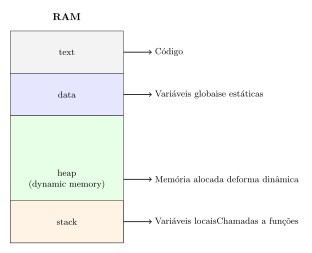
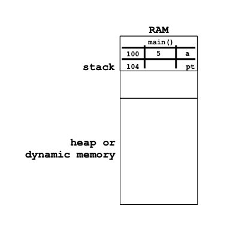
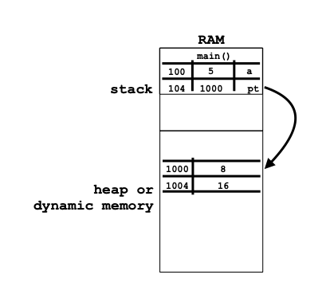
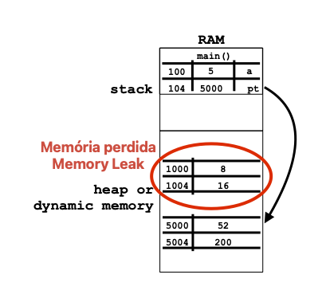
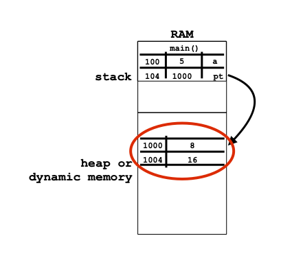
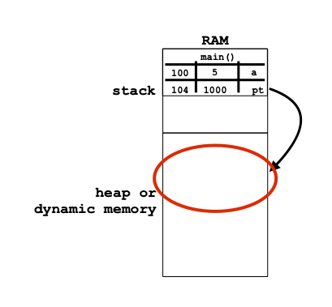
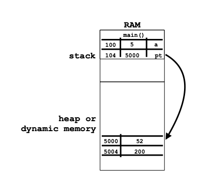

<style>
img[alt="logo"] {
  width: auto;  /* Adjust width */
  height: 25px; /* Keep aspect ratio */
  vertical-align: bottom; /* Align text with the image */
}
img[alt="pic_middle"] {
  width: auto;  /* Adjust width */
  height: 150px; /* Keep aspect ratio */
  vertical-align: middle; /* Align text with the image */
}
.grid {
  display: grid;
  grid-template-columns: 1fr 1fr;
  gap: 20px;
}

img[alt~="center"] {
  display: block;
  margin: 0 auto;
}
ul { list-style-type: none; padding-left: 0;}

</style>

# 📢 Linguagens de Programação 1  

<div data-marpit-fragment>


```c
printf("\aAula #9\n");
```

</div>

---

# 📚 Conteúdo da Aula

## Memórida Dinâmica

* Alocação estática VS dinâmica
* Memória dinâmica
* Memory leaks

## Argumentos da linha de comandos


---

# Memória em C

<div class='grid'>
<div>

### Memória Estática 🏛️
- Espaço alocado em tempo de compilação
- Tamanho fixo
- Controlado pelo compilador
- Ex: `int vetor[100];`

</div>
<div>

### Memória Dinâmica 🧠
- Espaço alocado em tempo de execução
- Tamanho flexível
- Controlado pelo programador
- Ex: `int *vetor = malloc(n * sizeof(int));`

</div>
</div>


---


<div class='grid'>
<div>

## 🧱 Organização da Memória

<small>

* **`text`**: código/instruções do programa - pequena e fixa (não muda durante a execução do programa)
* **`data`**: variáveis globais/estáticas - pequena e fixa
* **`stack`**: variáveis locais e chamadas de funções (*stack frames*) - pequena e fixa
* **`heap`**: espaço de memória que só pode ser alocada de forma dinâmica - **muito grande e pode variar durante a execução do programa**

</small>

</div>
<div>



</div>
</div>

---

## Como alocar memória dinâmica?

* Temos que recorrer a funções `malloc()` ou `calloc()` da biblioteca `<stdlib.h>`

* Essas funções "pedem" ao sistema operativo (SO) que reserve memória na zona `heap`.

* Quando o SO termina de reservar o epaço, ele retorna um apontador para a primeira posição de memória reservada.

* Caso não tenha conseguido reservar a memória, irá retornar `NULL`. Isso acontece se, por exemplo, tivermos esgotado a memória do computador.

---

## Alocação com `malloc` 🧰

<div class='grid'>
<div>

```c
void * malloc(size_t numero_de_bytes);
```

* retorna um ponteiro genérico `void *` que pode ser convertido em qualquer tipo de ponteiro, por exemplo `int *`.

* recebe o número de bytes que queremos reservar.

* Não esquecer de incluir a biblioteca `<stdlib.h>`

</div>
<div>


```c
char *p = (char *) malloc(100 * sizeof(char));

if (p != NULL) {
    strcpy(p, "use the force");

    printf("%s", p);

    free(p);
}
```

✅ Aloca, usa, liberta!

</div>
</div>


---

## Alocação de memória

<div class='grid'>
<div>

```c
int main()
{
  int a =  5;
  int * pt;


  return 0;
}
```

</div>
<div>



</div>
</div>


---

## Alocação de memória

<div class='grid'>
<div>

```c
int main()
{
  int a =  5;
  int * pt;

  pt = (int *) malloc(2 * sizeof(int));
  pt[0] = 8; pt[1] = 16;


  return 0;
}
```

</div>
<div>



</div>
</div>


---

## Alocação de memória

<div class='grid'>
<div>

```c
int main()
{
  int a =  5;
  int * pt;

  pt = (int *) malloc(2 * sizeof(int));
  pt[0] = 8; pt[1] = 16;
  pt = (int *) malloc(2 * sizeof(int));
  pt[0] = 52; pt[1] = 200;


  return 0;
}
```

</div>
<div>


</div>
</div>


---

## Alocação de memória

<div class='grid'>
<div>

```c
int main()
{
  int a =  5;
  int * pt;

  pt = (int *) malloc(2 * sizeof(int));
  pt[0] = 8; pt[1] = 16;
  pt = (int *) malloc(2 * sizeof(int));
  pt[0] = 52; pt[1] = 200;


  return 0;
}
```

</div>
<div>



</div>
</div>

---

## Alocação de memória

<div class='grid'>
<div>

```c
int main()
{
  int a =  5;
  int * pt;

  pt = (int *) malloc(2 * sizeof(int));
  pt[0] = 8; pt[1] = 16;


  return 0;
}
```

</div>
<div>



</div>
</div>

---


## Alocação de memória

<div class='grid'>
<div>

```c
int main()
{
  int a =  5;
  int * pt;

  pt = (int *) malloc(2 * sizeof(int));
  pt[0] = 8; pt[1] = 16;
  free(pt);


  return 0;
}
```

</div>
<div>



</div>
</div>

⚠️⚠️ Atenção que o apontador `pt`, após o `free(pt)` continua com um valor (no exemplo =1000), mas esse endereço é inválido. Se tentarmos aceder a `*pt` vamos crashar o programa.

---


## Alocação de memória

<div class='grid'>
<div>

```c
int main()
{
  int a =  5;
  int * p;

  p = (int *) malloc(2 * sizeof(int));
  pt[0] = 8; pt[1] = 16;
  free(p);

  p = (int *) malloc(2 * sizeof(int));
  pt[0] = 52; pt[1] = 200;
  return 0;
}
```

</div>
<div>



</div>
</div>

---

# Cuidado com a `heap` ⚠️

- Memória **não é libertada automaticamente** ❌
- Usar sempre `free()` para evitar *memory leaks* 🕳️
- Não usar mais o ponteiro após o `free()` 🔥

```c

int *v = (int *) malloc(100 * sizeof(int));

free(v);

// v agora aponta para memória não reservada!
```

---

# `calloc` vs `malloc` 🧮

```c
float *notas = (float *) calloc(n, sizeof(float));
```

| Função | Inicializa valores? |
|--------|---------------------|
| `malloc()` | Não                 |
| `calloc()` | Sim (a zero)        |

✅ Ideal para arrays iniciados a 0.

---

# Redimensionar: `realloc` 📏

```c
notas = (float *) realloc(notas, novo_n * sizeof(float));
```

- Tenta redimensionar bloco existente
- Se não conseguir, aloca novo bloco e copia
- Cuidado: pode devolver `NULL` se não conseguir. Por exemplo se a memória tiver cheia.


---

# Função que aloca vector 📊


<div class='grid'>
<div>

```c
#include <stdlib.h>

int *novoVetor(int n) {

  int *v = (int *) calloc(n, sizeof(int));

  return v;
}
```

</div>
<div>

* Se usarmos memória dinâmica, já é possível retornar uma variável alocada dentro de uma função.
* A memória alocada persiste até o programa terminar ou até ser chamada a função `free()`.
* Para aceder à memória alocada só necessitamos do apontador, mas podemos faze-lo a partir de qualquer função.

</div>
</div>

---

# Retornar Strings Dinâmicas 💎

<div class='grid'>
<div>


* NÃO FUNCIONA:

```c
char *foo() {
  char s[] = "Ola";
  return s;
}
```

* FUNCIONA:

```c
char *foo() {
  char *s = (char *) malloc(4 * sizeof(char));
  if (s != NULL) {
    strcpy(s, "Ola");
  }
  return s;
}
```

</div>
<div>

| Stack           | Heap                |
|-----------------|---------------------|
| `s[]` (local)   | Perde-se!            |
| `s` (dinâmico)  | Persiste após retorno |

🤖 Usar `malloc()` ou `calloc()` para retornar strings!

</div>
</div>

---


# Exemplo completo 🎯

```c
#include <stdio.h>
#include <stdlib.h>

int main(void) {
    int n;
    scanf("%d", &n);
    float *notas = (float *) malloc(n * sizeof(float));
    if (notas == NULL) {
        printf("Out of memory!\n");
        return 1;
    }
    // usar notas[] aqui
    free(notas);
    return 0;
}
```

✅ Aloca conforme input!

---


## ❓  Quizz - Memória Dinamica

<br>


<br>


- No campo nome devem colocar o **número de aluno** 2XXXXXXX.


---


# Quiz 🧠

```c
char *newChar(char letra) {
    char *pt = (char *) calloc(1, sizeof(char));
    *pt = letra;
    pt = &letra;
    return pt;
}
```

❌ O que está mal? Resposta:
- Linha `pt = &letra;` faz com que o ponteiro deixe de apontar para o bloco reservado.
- A memória fica **perdida**.

✅ Solução: eliminar essa linha.

---

# Dicas Finais 💡

- Liberta sempre a memória com `free()` ✅
- Verifica `NULL` após `malloc`/`calloc` ❗
- Não reutilizes ponteiros libertados ❌
- Usa ferramentas como `valgrind` para detetar *memory leaks* 🧪

---


# Argumentos da linha de comandos

---

# O que são argumentos na linha de comandos? 🧐

- Quando executamos um programa, podemos **passar argumentos** pela linha de comandos.
- Exemplo em Linux:
  
```bash
$ cp ficheiro1.c ficheiro1_copy.c
```

🧠 O programa `cp` é chamado com dois argumentos: `"ficheiro1.c"` e `"ficheiro1_copy.c"`

---

# Exemplo em Windows 💻

```dos
C:\> copy ficheiro1.c ficheiro1_copy.c
```

- O programa `copy` é chamado com:
  - `"ficheiro1.c"`
  - `"ficheiro1_copy.c"`

---

# Função `main` com argumentos 📦

```c
int main(int argc, char *argv[])
```

- `argc` ➜ Número de parâmetros (argumnentos) passados (inclui o nome do programa) 🔢
- `argv` ➜ Vetor de *strings* com os argumentos 👈
- O `main` ou não tem parâmetros (`void`), ou tem `argc` e `argv`. Não pode ter outros parâmetros.

---

# Representação visual 🧠

```bash
$ ./prog arg 10 47.2
```

| Índice (`i`) | `argv[i]`       |
|-------------|------------------|
| 0           | "./prog"         |
| 1           | "arg"            |
| 2           | "10"             |
| 3           | "47.2"           |
| 4           | `NULL` (fim)     |

`argc == 4`

---

# Código exemplo completo 🔍

```c
#include <stdio.h>

int main(int argc, char *argv[])
{

  for (int i = 0; i < argc; i++) {
    printf("Parametro %d: %s\n", i, argv[i]);
  }

  return 0;
}
```

---

# Equivalência de declaração ✅

<div class='grid'>
<div>

```c
int main(int argc, char *argv[])
```

</div>
<div>

```c
int main(int argc, char **argv)
```

</div>
</div>

Ambas as formas são válidas!  
👉 `argv[]` é um vetor de ponteiros para `char`, ou seja, `char **`

---

# 🧪 Quiz: o que imprime?

Programa executado com:

```bash
$ ./ola mundo
```

```c
int main(int argc, char *argv[]) {
  printf("%s\n", argv[1]);
  return 0;
}
```

🧠 Resposta: `mundo`

---

# Dica prática 💡

🔤 Todos os argumentos são **strings** (`char *`), mesmo que pareçam números!

```c
printf("%d\n", atoi(argv[1])); // converte para inteiro
printf("%f\n", atof(argv[2])); // converte para float
```

- versão mais sofisticada e mais segura:
```c
int x;
if (argc <= 1 || sscanf(argv[1], "%d", &x) != 1)
{
  puts("erro, numero nao detectado");
  return 1;
}
```

- programa não crasha se o utilizador não introduzir os dados na linha de comandos


---

# Resumo 📚

| Conceito | Significado | Tipo | 
|---------|-------------|-----|
| `argc`  | Quantos argumentos foram passados.  | `int` (inteiro)|
| `argv`  | Vetor com os argumentos (strings) | `char **` (vector de strings) | 
| `argv[0]` | Nome do programa | `char *` (string) |
| Conversão | Usa `atoi`, `atof`, `strtol`, `sscanf` etc | |


---


## 🧪  Quizz - Argumentos da linha de comandos

<br>


<br>


- No campo nome devem colocar o **número de aluno** 2XXXXXXX.


---

# Fim ✨

Perguntas? 🙋‍♀️🙋‍♂️

